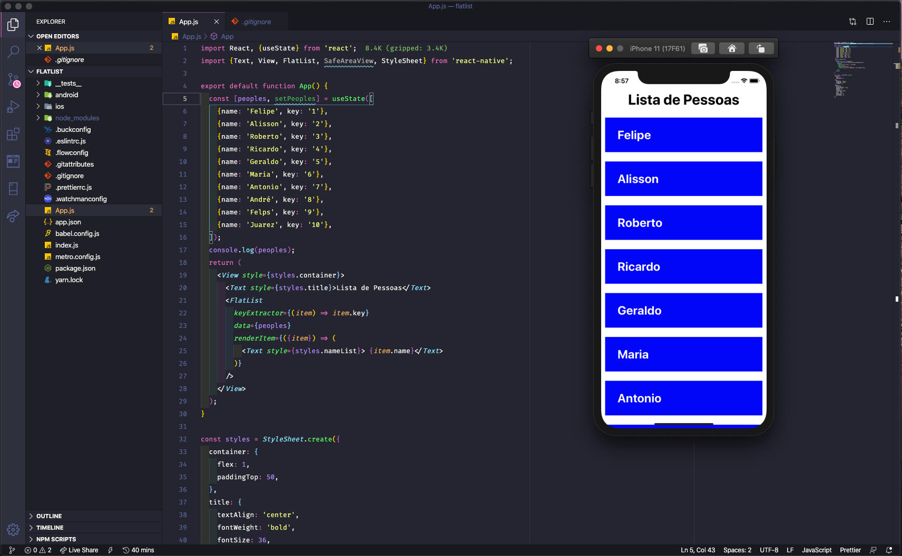

<!-- PROJECT LOGO -->
<br />
<p align="center">
    <h3 align="center">Uma simples Flatlist em ReactNative</h3>
</p>


<!-- ABOUT THE PROJECT -->
## Sobre o Projeto


Uma simples implementação de uma flatlist para mostrar nomes de pessoas



<!-- GETTING STARTED -->
## Iniciando o Projeto

### Pré-requisitos
* React Native

### Instalação

1. Clone o projeto
```sh
git clone https://github.com/felipealvescosta/simple-flatlist.git
```

2. Entre na pasta
```sh
cd flatlist
```

3. Instale as dependências
```sh
yarn install
```
4. Rode o projeto
```JS
yarn ios
```


<!-- CONTACT -->
## Contato

Felipe Alves - [@felpsacosta](https://instagram.com/felpsacosta) - contato@felipealvescosta.com

Projeto: [https://github.com/felipealvescosta/simple-flatlist](https://github.com/felipealvescosta/simple-flatlist)